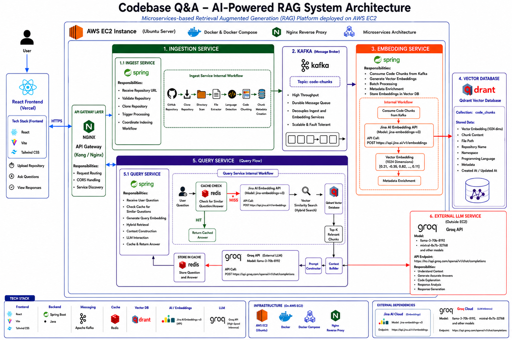

# Codebase Q&A

> AI-powered **Retrieval-Augmented Generation (RAG)** system for natural-language Q&A over any codebase.  
> Ingest a GitHub repository, vectorize its source code, and ask questions in plain English.

[](https://codebase-q-a-frontend.vercel.app/)

---

## Try It Live

**No setup required.** Experience the app instantly at:

### [codebase-q-a-frontend.vercel.app](https://codebase-q-a-frontend.vercel.app/)

Paste any public GitHub repository URL, wait for ingestion, and start asking questions about the codebase in natural language.

---

## Overview

**Codebase Q&A** is a microservices-based platform that lets you chat with your code. It clones a repository, chunks the source files, generates vector embeddings, and stores them in a high-performance vector database. When you ask a question, it performs semantic search to retrieve the most relevant code snippets and synthesizes a contextual answer.



---

## Features

- **One-Click Ingestion** — Submit a GitHub URL and the system automatically clones, chunks, and vectorizes the codebase.
- **Semantic Search** — Ask natural-language questions; the system retrieves the most relevant code chunks via vector similarity.
- **Asynchronous Processing** — Kafka decouples ingestion from embedding generation for reliable, scalable pipelines.
- **Response Caching** — Redis caches frequent queries to reduce latency and LLM costs.
- **Microservices Architecture** — Each concern is isolated in its own Spring Boot service for independent scaling and deployment.
- **Live Frontend** — A deployed web interface at [codebase-q-a-frontend.vercel.app](https://codebase-q-a-frontend.vercel.app/) for instant access.

---

## Architecture

| Layer | Technology | Purpose |
|-------|-----------|---------|
| **Gateway** | Spring Boot | Single entry point, routing, auth, rate limiting |
| **Ingest** | Spring Boot | Clone repos, chunk source files, publish to Kafka |
| **Embedding** | Spring Boot | Consume chunks, generate vectors via LLM, upsert to Qdrant |
| **Query** | Spring Boot | Embed questions, search Qdrant, synthesize answers, cache in Redis |
| **Message Broker** | Apache Kafka 3.9.1 (KRaft) | Async job queue between Ingest and Embedding |
| **Vector DB** | Qdrant | Store and search high-dimensional embeddings |
| **Cache** | Redis 7 | LRU cache for query responses |
| **Frontend** | React (Vercel) | User-facing web interface |
| **Shared Lib** | `common-dto` | Reusable DTOs and utilities across services |

### Data Flow

**Ingestion Pipeline**
1. User submits a repository URL via the **Frontend** or **API Gateway**.
2. The **Ingest Service** clones the repo and splits files into code chunks.
3. Chunks are published to a **Kafka** topic.
4. The **Embedding Service** consumes chunks, generates embeddings, and upserts them into **Qdrant**.

**Query Pipeline**
1. User submits a natural-language question via the **Frontend** or **API Gateway**.
2. The **Query Service** checks **Redis** for a cached response.
3. On cache miss, the question is embedded and a **vector similarity search** is run against **Qdrant**.
4. Top-k relevant code chunks are retrieved and used to synthesize an answer.
5. The result is cached in **Redis** and returned to the user.

---

## Tech Stack

| Category | Technology |
|----------|------------|
| Language | Java 17+ |
| Framework | Spring Boot |
| Build Tool | Maven / Gradle |
| Message Broker | Apache Kafka 3.9.1 (KRaft mode) |
| Vector Database | Qdrant |
| Cache | Redis 7 (Alpine) |
| Containerization | Docker & Docker Compose |
| Frontend | React (deployed on Vercel) |

---

## Prerequisites (For Local Development)

- [Docker](https://docs.docker.com/get-docker/) & Docker Compose
- Java 17 or higher
- Maven 3.9+ or Gradle 8+
- (Optional) [Git](https://git-scm.com/) for cloning repos locally

---

## Getting Started

### Quick Start — Try the Live App

Visit **[codebase-q-a-frontend.vercel.app](https://codebase-q-a-frontend.vercel.app/)** and start using the app immediately — no installation needed.

### Local Development

#### 1. Clone the repository

```bash
git clone https://github.com/Ash8389/Codebase_Q-A.git
cd Codebase_Q-A
```

#### 2. Start infrastructure services

```bash
docker compose up -d
```

This brings up:

| Service | Port | Description |
|---------|------|-------------|
| **Qdrant** | `6333` (REST), `6334` (gRPC) | Vector database with persistent storage |
| **Redis** | `6379` | LRU cache capped at 256 MB |
| **Kafka** | `9092` | KRaft-mode broker (no Zookeeper) |

Verify health:

```bash
docker compose ps
```

#### 3. Build all microservices

```bash
# API Gateway
cd apiGatewayService/apiGatewayService
./mvnw clean install

# Ingest Service
cd ../../ingest_service/ingest_service
./mvnw clean install

# Embedding Service
cd ../../embedding_Service/embedding_Service
./mvnw clean install

# Query Service
cd ../../query-service/query-service
./mvnw clean install

# Shared DTOs
cd ../../common-dto
./mvnw clean install
```

> **Tip:** If you have a multi-module Maven setup, you can build from the root with `mvn clean install`.

#### 4. Run the services

Start in the following order to ensure dependencies are ready:

```bash
# 1. Embedding Service (Kafka consumer must be up first)
# 2. Ingest Service
# 3. Query Service
# 4. API Gateway (last)
```

Each service can be started with:

```bash
./mvnw spring-boot:run
```

---

## Configuration

Each service uses `application.properties` or `application.yml`. Key properties:

| Property | Description | Default |
|----------|-------------|---------|
| `qdrant.host` | Qdrant server host | `localhost` |
| `qdrant.port` | Qdrant gRPC port | `6334` |
| `spring.kafka.bootstrap-servers` | Kafka broker address | `localhost:9092` |
| `spring.data.redis.host` | Redis host | `localhost` |
| `spring.data.redis.port` | Redis port | `6379` |

---

## API Reference

All client requests go through the **API Gateway**.

### Ingest a Repository

```http
POST /api/ingest
Content-Type: application/json

{
  "repoUrl": "https://github.com/username/repository"
}
```

**Response:**

```json
{
  "jobId": "550e8400-e29b-41d4-a716-446655440000",
  "status": "ACCEPTED",
  "message": "Repository ingestion started."
}
```

### Ask a Question

```http
POST /api/query
Content-Type: application/json

{
  "question": "How does the authentication flow work?"
}
```

**Response:**

```json
{
  "answer": "The authentication flow is handled by the AuthFilter...",
  "sources": [
    "src/main/java/com/example/AuthFilter.java",
    "src/main/java/com/example/SecurityConfig.java"
  ],
  "cached": false
}
```

> **Note:** Exact endpoint paths may vary depending on your gateway routing configuration in `apiGatewayService`.

---

## Project Structure

```
Codebase_Q-A/
├── docker-compose.yml              # Infrastructure: Qdrant, Redis, Kafka
├── common-dto/                     # Shared DTOs & models
├── apiGatewayService/
│   └── apiGatewayService/          # API Gateway Spring Boot app
├── ingest_service/
│   └── ingest_service/             # Code ingestion service
├── embedding_Service/
│   └── embedding_Service/          # Embedding generation service
└── query-service/
    └── query-service/              # Q&A query service
```

---

## Roadmap

- [x] Deployed live frontend for instant access
- [ ] Add support for local file uploads (not just GitHub URLs)
- [ ] Implement streaming responses for real-time Q&A
- [ ] Add OAuth2 / JWT authentication
- [ ] Multi-repo context switching
- [ ] Support for additional vector DBs (Pinecone, Weaviate, Milvus)

---

## Acknowledgements

- [Spring Boot](https://spring.io/projects/spring-boot)
- [Apache Kafka](https://kafka.apache.org/)
- [Qdrant](https://qdrant.tech/)
- [Redis](https://redis.io/)
- [Vercel](https://vercel.com/) — for frontend hosting
